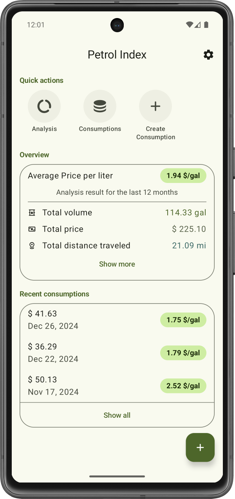
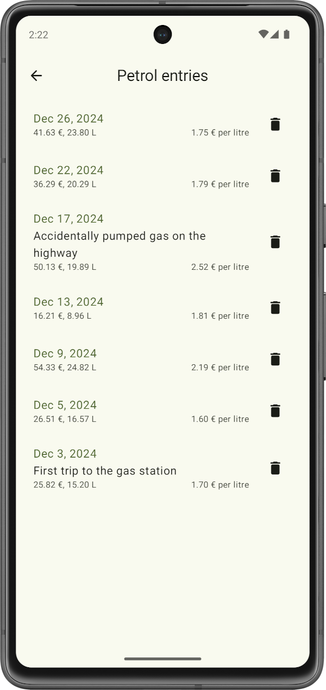
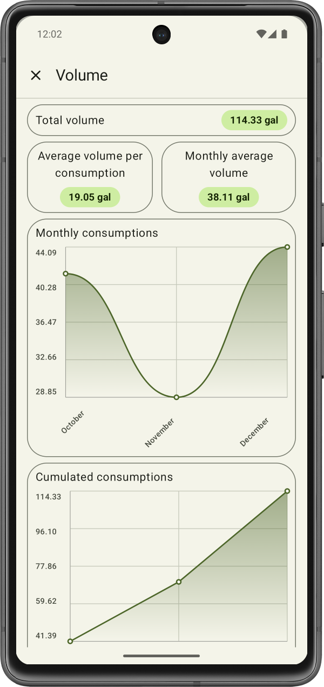

# Petrol Index

Have you ever been interested in knowing how much petrol you consume? Fear no more, Petrol Index documents your petrol consumtion.

    
    
    

###### Table of Contents
1. [Description](#description)
2. [Install and Use the Project](#install-and-use-the-project)
3. [Contributors](#contributors)
4. [License](#license)
5. [How to contribute](#how-to-contribute)

 

## Description
Petrol Index allows you to document your petrol consumption on your device locally. You can add as many trips to the petrol station as you wish.

###### Used Technologies
The application is developed with Jetpack Compose and Kotlin through the Android Studio IDE. Therefore, the app is built using Gradle and Kotlin DSL.

The app uses Google's Material Design 3 to implement a comfortable and visually pleasing design that users can work with intuitively.

###### Miscellaneous
The version numbers for this project are determined based on the guidelines provided by [semver](https://semver.org/).

The project contains a [changelog](CHANGELOG.md) which documents all changes that were made to the application in between software versions.

 

## Install and Use the Project
If you want to use the app, you can download the APK file [here](https://github.com/Christian-2003/petrol-index/releases/latest).

 

## Contributors
Currently, I ([Christian-2003](https://github.com/Christian-2003)) am the only developer.

 

## License
The project is licensed under the terms and conditions of the MIT license. You can view a copy of the license [here](https://github.com/Christian-2003/password-vault/blob/master/LICENSE.txt).

 

## How to Contribute
If you want to contribute to this project, feel free to do so.

Feel free to open issues, for anything you feel is appropriate. If you want to report bugs, please provide steps to reproduce the bug.

If you want to contribute to the code development, be a self respecting person and use the coding guidelines for Kotlin that are taught in school and university.

The project will be developed in English.

 

***
2024-12-28  
&copy; Christian-2003
