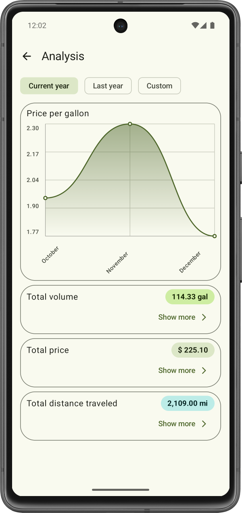

# Petrol Index

Have you ever been interested in knowing how much petrol you consume? Fear no more, Petrol Index documents your petrol consumption.

    
    
    

###### Table of Contents
1. [Description](#description)
2. [Install and Use the Project](#install-and-use-the-project)
3. [Contributors](#contributors)
4. [License](#license)
5. [How to contribute](#how-to-contribute)
6. [Additional Images](#additional-images)

 

## Description
Petrol Index allows you to document your petrol consumption on your device locally. You can add as many petrol consumptions as you wish.

###### Technologies Used
The application is developed with Jetpack Compose and Kotlin through the Android Studio IDE. Therefore, the app is built using Gradle.

The app uses Material Design 3 Expressive to implement a comfortable user interface that is visually pleasing. Users should be able to work with the user interface of the app intuitively.

###### Miscellaneous
The version numbers for this project are determined based on the guidelines provided by [semver](https://semver.org/).

The project contains a [changelog](CHANGELOG.md) which documents all changes that were made to the application in between software versions.

 

## Install and Use the Project
This section helps you to install and use the app on you Android device.

###### System Requirements
In order to use Petrol Index, you need to fulfil the following requirements:
* Have an Android device with version **Android 15** or higher
* Have **8 MB** of internal storage

###### Installation Guide
1. Download the latest version of the APK file through [GitHub releases](https://github.com/Christian-2003/petrol-index/releases/latest).
2. Locate the APK file downloaded through your file explorer. The APK file is typically stored in the "Downloads"-folder.
3. Click on the downloaded APK file.
4. Usually, a dialog appears that makes you confirm the installaton. On this dialog, click "Confirm".
5. Usually, Google Play Protect wants to scan the app before installing. Click "Scan" on the next dialog.
6. Once Google Play Protect finishes scanning the app, click "Continue".
7. Now, the app has been installed successfully.

###### First Steps
The app includes an onboarding which describes the apps features briefly.  
Once you finish the onboarding, click the "+"-button in the bottom right corner of the home screen to add a petrol consumption.  
Once you add at least one petrol entry, you get access to the analysis of your consumption which allows you to track your petrol use.

 

## Contributors
Currently, I ([Christian-2003](https://github.com/Christian-2003)) am the only developer.

 

## License
The project is licensed under the terms and conditions of the MIT license. You can view a copy of the license [here](LICENSE.txt).

 

## How to Contribute
If you want to contribute to this project, feel free to do so.

Feel free to open issues, for anything you feel is appropriate. If you want to report bugs, please provide steps to reproduce the bug.

If you want to contribute to the code development, be a self respecting person and use the coding guidelines for Kotlin that are taught in school and university.

A few guides for development-purposes are published [here](/docs/development/). If you are interested in contributing, this would be a good start.

The project will be developed in English.

 

## Additional Images

    
    

 

***
2025-09-29  
&copy; Christian-2003
